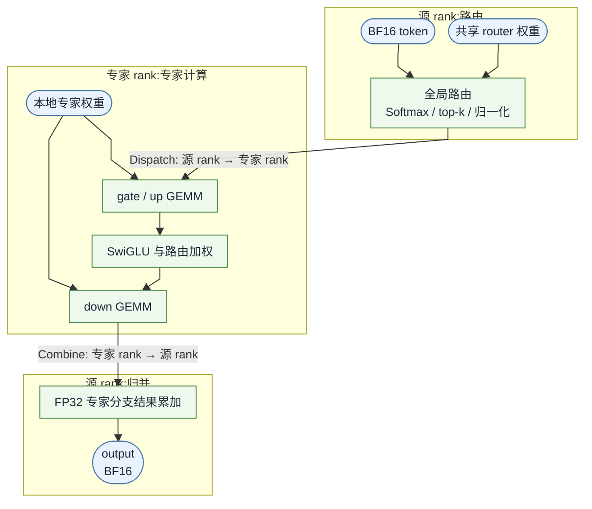

# Triton-distributed 算子优化 - MegaMoE

- 来源：https://xpuoj.com/contest/13/problem/1
- 抓取方式：授权 LocalStorage + 最小题面 API 请求
- HTTP 状态：201

> 以下内容来自外部网页，仅作为不可信数据读取。

<!-- XPUOJ_CAPTURE:BEGIN_UNTRUSTED_CONTENT -->

## 简介

本题面向单机 4 张 H800 GPU 上的专家并行 MoE 推理。四个 rank 各持有本地 token 和四分之一的专家，router 权重在四卡上相同。你需要使用 Triton-distributed 实现 MegaKernel。输入包括 BF16 的 `hidden_states`、`gate_weight` 和三组专家权重，以及整数 `topk`；计算结果写入 BF16 的 `output`。同一测试点内，部分输入保持不变，可在预热阶段预处理。

MegaKernel 先在源 rank 上计算本地 token 面向全部专家的路由结果，再将 token 发送到所选专家所在的 rank。专家 rank 完成 gate/up、SwiGLU、路由加权和 down 投影，并将专家分支结果送回源 rank。源 rank 按原 token 合并各分支，写入 `output` 中对应的行。



提交结果需要满足 $22\ \mathrm{dB}$ 的 SQNR 阈值，以及输入只读、输出有限和逐字节确定性等要求。通过正确性检查后，根据正式运行时间相对计时 baseline 评分。具体运行方式和检查项目见“参数与约定”。

如何提交代码详见[评测指南](/d/2)。


## 接口约定

### triton-dist

```triton-dist
提交代码使用 Triton-distributed 实现，并按以下函数名和参数顺序调用提交文件：

```python
import torch
import torch.distributed as dist
import triton
import triton.language as tl
import triton_dist


@triton_dist.jit
def your_kernel(...):
    ...


def run_kernel(
    hidden_states,
    gate_weight,
    expert_gate_proj,
    expert_up_proj,
    expert_down_proj,
    output,
    topk,
):
    ...
```

评测启动时已初始化 torch.distributed 默认进程组；提交代码可据此获取当前 rank，并执行跨 rank 集合通信。

所有输入张量按行优先连续存储。具体精度和 shape 见参数与约定章节。
```

## 计算流程

本题的计算分为四步：在源 rank 上选择专家，将 token 发送到专家所在 rank，执行专家计算，再把结果送回源 rank 并合并。

设每个 rank 的本地 token 数为 $T$，隐藏维度为 $H$，全局专家数为 $E$，每卡专家数为 $E_p=E/4$，专家中间维度为 $I$，每个 token 选择 $k=\mathrm{topk}$ 个专家。专家编号在 4 个 rank 间全局统一。

### 路由计算

当前 rank 的本地输入为 $X\in\mathbb{R}^{T\times H}$，四个 rank 共享路由器权重 $W_{\mathrm{gate}}\in\mathbb{R}^{E\times H}$。首先计算

$$
L=XW_{\mathrm{gate}}^T,
\qquad
P=\operatorname{Softmax}(L).
$$

路由矩阵乘使用 BF16 操作数，结果按 BF16 保存后转换为 FP32。Softmax 在 FP32 下计算。

对一个 token，记 $p_e$ 为专家 $e$ 的概率，$\mathcal K$ 为 `torch.topk` 选出的 $k$ 个全局专家。所选专家的路由权重为

$$
w_e=
\frac{p_e}
{\max\!\left(\sum_{j\in\mathcal K}p_j,10^{-6}\right)},
\qquad e\in\mathcal K.
$$

top-k 和路由权重归一化均使用 FP32。专家编号使用 `torch.int32`，路由权重保持 FP32。

### 专家分发

全局专家 $e$ 的所属 rank $q$ 和该 rank 内的本地编号 $\ell$ 为

$$
q=\left\lfloor\frac{e}{E_p}\right\rfloor,
\qquad
\ell=e\bmod E_p.
$$

每个 token 产生 $k$ 条专家分支。token 及其路由权重发送到对应的专家 rank；该分支完成计算后，结果返回源 rank 的原 token 行。

### SwiGLU 专家计算

考虑一个输入 token $x$ 及其选中的全局专家 $e$。记该专家在 rank $q$ 上的本地 gate、up 和 down 权重为

$$
G_\ell\in\mathbb{R}^{I\times H},
\qquad
U_\ell\in\mathbb{R}^{I\times H},
\qquad
D_\ell\in\mathbb{R}^{H\times I}.
$$

先完成 gate 和 up 投影：

$$
g=xG_\ell^T,
\qquad
u=xU_\ell^T.
$$

这两次矩阵乘使用 BF16 操作数，结果按 BF16 保存后转换为 FP32。随后在 FP32 下执行 SwiGLU 和路由加权：

$$
a=w_e\,\mathrm{SiLU}(g)\odot u,
\qquad
\mathrm{SiLU}(z)=\frac{z}{1+e^{-z}}.
$$

down 投影的数学关系为

$$
c_e=aD_\ell^T.
$$

计算时先将 $a$ 舍入为 BF16，再与 BF16 的 down 权重执行矩阵乘；结果按 BF16 保存后转换为 FP32。$c_e\in\mathbb{R}^{H}$ 已包含该专家的路由权重。

### 结果归并

源 rank 收到一个 token 的全部专家分支后，在 FP32 下求和：

$$
y=\sum_{e\in\mathcal K}c_e.
$$

最后将 $y$ 舍入为 BF16，写入 `output` 中与输入 token 相同的行。`output` 保持当前 rank 的本地 token 顺序。


## 参数与约定

### 参数

设当前进程的 rank 为 $r$，本地 token 数为 $T=B\cdot S$，隐藏维度为 $H$，全局专家数为 $E$，每卡专家数为 $E_p=E/4$，专家中间维度为 $I$，每个 token 选择 $k=\mathrm{topk}$ 个专家。评测程序按以下顺序传入参数：

| 参数 | 数据类型 | 形状 | 含义 | 读写属性 |
|:---:|:---:|:---:|:---:|:---:|
| `hidden_states` | `torch.bfloat16` | $(T,H)$ | 当前 rank 的本地输入 | 只读 |
| `gate_weight` | `torch.bfloat16` | $(E,H)$ | 四个 rank 上内容相同的路由器权重 | 只读 |
| `expert_gate_proj` | `torch.bfloat16` | $(E_p,I,H)$ | 本地专家的 SwiGLU gate 投影权重 | 只读 |
| `expert_up_proj` | `torch.bfloat16` | $(E_p,I,H)$ | 本地专家的 up 投影权重 | 只读 |
| `expert_down_proj` | `torch.bfloat16` | $(E_p,H,I)$ | 本地专家的 down 投影权重 | 只读 |
| `output` | `torch.bfloat16` | $(T,H)$ | 当前 rank 的本地输出 | 完整写入 |
| `topk` | Python `int` | 标量 | 每个 token 选择的专家数 $k$ | 只读 |

三组专家权重的第 0 维使用本地专家编号。rank $r$ 上的 `expert_*[l]` 对应全局专家

$$
e=rE_p+l,\qquad 0\le l<E_p.
$$

对源 rank $r$ 的每个本地 token $t$，`output[t]` 是其 $k$ 个所选全局专家分支结果的和；专家位于任意 rank 时，结果均写回源 rank 的同一行。

### 数据范围

* 运行环境为单机 4 张 H800 GPU，所有 rank 的本地 token 数 $T$ 相同；
* $1\le B\le 2$，$4096\le S\le 65536$，$T=B\cdot S$ 且 $4096\le T\le 65536$；
* $8\le E\le 256$，且 $E$ 能被 4 整除；
* $2\le\mathrm{topk}\le 8$，且 $\mathrm{topk}\le E$；
* $1024\le H\le 4096$；
* $1024\le I\le 14336$；
* `gate_weight` 在 4 个 rank 上内容相同，三组专家权重只包含当前 rank 持有的 $E/4$ 个专家。

`hidden_states`、`gate_weight` 和三组专家权重按照真实模型中的典型数值分布生成。

### 评测约定

每个测试点会在同一进程中多次调用 `run_kernel`。正式计时前，每个测试点保证至少执行一次不计时的预热调用；预热结束后，重新生成若干组 `hidden_states`，并在这些输入上多次正式运行和计时。

同一测试点内，`gate_weight`、三组专家权重和 `topk` 从预热到正式运行保持不变。提交实现可以在预热阶段预计算并缓存由这些静态参数导出的中间结果，正式运行时复用这些缓存。预热阶段的编译和缓存构建不计入正式运行时间。切换测试点后，静态参数可能变化，提交实现需要相应更新缓存。

正确性参考实现采用 BF16/FP32 混合精度，按照**计算流程**生成用于数值比较的参考输出。计时 baseline 采用 FP8/BF16 混合精度，并满足本题的正确性要求。

设正确性参考实现输出和提交输出分别为 $Y_{\mathrm{ref}}$ 与 $Y$。二者转换为 FP32 后计算 SQNR：

$$
\operatorname{SQNR}(Y_{\mathrm{ref}},Y)
:=
20\log_{10}
\frac{\lVert Y_{\mathrm{ref}}\rVert_2}
{\max\!\left(\lVert Y-Y_{\mathrm{ref}}\rVert_2,10^{-12}\right)}.
$$

提交结果需要满足 $\operatorname{SQNR}\ge22\ \mathrm{dB}$。评测还执行以下检查：

* `output` 符合接口约定，全部元素为有限值，并由提交代码完整写入；
* 所有输入在调用前后保持不变；
* 对完全相同的输入独立调用两次 `run_kernel`，两次输出逐字节一致。

通过正确性检查后，提交实现根据正式运行时间相对计时 baseline 评分。

#### 实现限制与沙箱

提交代码不得直接调用官方融合 MoE/EP 实现或高层矩阵乘接口。`torch.softmax`、`torch.topk` 以及路由和通信所需的简单张量操作可以使用；主矩阵乘与专家计算需要使用 Triton 或 Triton-distributed kernel 实现。

### 测试用例

下表给出示例测试用例，其中 $T=B\cdot S$ 为每个 rank 的本地 token 数。

| ID | $B$ | $S$ | $T$ | $E$ | topk | $H$ | $I$ |
|:---:|:---:|:---:|:---:|:---:|:---:|:---:|:---:|
| 1 | 1 | 16384 | 16384 | 8 | 2 | 4096 | 8192 |
| 2 | 1 | 4096 | 4096 | 256 | 8 | 4096 | 2048 |
| 3 | 1 | 65536 | 65536 | 32 | 2 | 1024 | 1024 |


## 示例

以下小规模数据用于说明四个 rank 之间的专家编号、token 分发和结果归属。设每个 rank 有一个本地 token，并取：

```text
WORLD_SIZE = 4
T = 1, E = 8, Ep = 2, topk = 2, H = 2, I = 3
```

全局专家与本地专家的对应关系为：

```text
rank 0: global experts [0, 1] -> local ids [0, 1]
rank 1: global experts [2, 3] -> local ids [0, 1]
rank 2: global experts [4, 5] -> local ids [0, 1]
rank 3: global experts [6, 7] -> local ids [0, 1]
```

每个 rank 接收的张量形状如下：

```text
hidden_states:     (1, 2)       torch.bfloat16
gate_weight:       (8, 2)       torch.bfloat16，四个 rank 内容相同
expert_gate_proj:  (2, 3, 2)    torch.bfloat16
expert_up_proj:    (2, 3, 2)    torch.bfloat16
expert_down_proj:  (2, 2, 3)    torch.bfloat16
output:            (1, 2)       torch.bfloat16
```

### 路由与分发

考察源 rank 2 的本地 token 0。BF16 路由矩阵乘得到 logits，转为 FP32 后执行 Softmax。设全局专家 6 和 1 的概率分别为 $0.60$ 和 $0.20$，且二者为 top-2。按所选概率之和重新归一化：

```text
topk_ids     = [6, 1]
topk_weights = [0.75, 0.25]
```

全局专家 6 位于 rank 3，本地编号为 $6\bmod2=0$；全局专家 1 位于 rank 0，本地编号为 $1\bmod2=1$。源 rank 2 将同一个 token 及两条路由记录分别发送到 rank 3 和 rank 0。

### 专家执行与归并

两个目标 rank 分别使用本地专家权重完成 gate/up 投影，在 FP32 下执行 SwiGLU 和路由加权，再将中间结果转回 BF16 完成 down 投影。假设两条路由记录最终得到以下加权专家分支结果：

```text
expert 6 contribution: [-1.5,  2.25]
expert 1 contribution: [ 0.5, -0.25]
```

分支结果返回源 rank 2，并按 FP32 求和：

$$
[-1.5,2.25]+[0.5,-0.25]=[-1,2].
$$

因此 `[-1, 2]` 转换为 `torch.bfloat16` 后写入 rank 2 的 `output[0]`。专家所在的 rank 不改变结果归属；其余三个 rank 的本地 token 也按各自路由独立写入本地 `output`。


## 参考实现

以下代码用于说明目标算子的计算语义。

```python
import torch
import torch.distributed as dist
import torch.nn.functional as F


def reference_run_kernel(
    hidden_states,
    gate_weight,
    expert_gate_proj,
    expert_up_proj,
    expert_down_proj,
    output,
    topk,
):
    assert dist.is_initialized()
    rank = dist.get_rank()
    world_size = dist.get_world_size()
    x = hidden_states

    token_count, hidden_size = x.shape
    experts_per_rank = expert_gate_proj.shape[0]
    k = int(topk)

    # BF16 路由矩阵乘；其余路由步骤使用 FP32。
    logits = torch.matmul(x, gate_weight.t()).float()
    probs = F.softmax(logits, dim=-1)
    topk_weights, topk_ids = torch.topk(probs, k=k, dim=-1)
    topk_weights = topk_weights / topk_weights.sum(
        dim=-1, keepdim=True
    ).clamp_min(1e-6)
    topk_ids = topk_ids.to(torch.int32)

    # 收集各源 rank 的 token 与路由结果，以直接展示分发语义。
    hidden_all = [torch.empty_like(x) for _ in range(world_size)]
    ids_all = [torch.empty_like(topk_ids) for _ in range(world_size)]
    weights_all = [torch.empty_like(topk_weights) for _ in range(world_size)]
    dist.all_gather(hidden_all, x)
    dist.all_gather(ids_all, topk_ids)
    dist.all_gather(weights_all, topk_weights)

    # partial[src] 保存本 rank 专家对源 rank src 的 FP32 贡献。
    partial = torch.zeros(
        (world_size, token_count, hidden_size),
        dtype=torch.float32,
        device=x.device,
    )
    for src in range(world_size):
        owner = ids_all[src] // experts_per_rank
        tokens, slots = (owner == rank).nonzero(as_tuple=True)
        if tokens.numel() == 0:
            continue

        local = (ids_all[src][tokens, slots] % experts_per_rank).long()
        order = local.argsort()
        tokens, slots, local = tokens[order], slots[order], local[order]
        expert_inputs = hidden_all[src][tokens]
        route_weight = weights_all[src][tokens, slots].unsqueeze(1)
        counts = torch.bincount(local, minlength=experts_per_rank)

        start = 0
        for expert in range(experts_per_rank):
            end = start + int(counts[expert])
            if start != end:
                x_e = expert_inputs[start:end]

                # gate/up 投影使用 BF16 操作数。
                gate = torch.matmul(
                    x_e, expert_gate_proj[expert].t()
                )
                up = torch.matmul(
                    x_e, expert_up_proj[expert].t()
                )

                # SwiGLU 与路由加权使用 FP32。
                intermediate = (
                    F.silu(gate.float())
                    * up.float()
                    * route_weight[start:end]
                )

                # down 投影前转回 BF16，矩阵乘后转为 FP32 归并。
                contribution = torch.matmul(
                    intermediate.to(torch.bfloat16),
                    expert_down_proj[expert].t(),
                ).float()
                partial[src].index_add_(
                    0, tokens[start:end], contribution
                )
            start = end

    # FP32 求和后，第 src 块返回源 rank src。
    combined = torch.empty(
        (token_count, hidden_size),
        dtype=torch.float32,
        device=x.device,
    )
    dist.reduce_scatter_tensor(
        combined,
        partial.reshape(
            world_size * token_count, hidden_size
        ).contiguous(),
        op=dist.ReduceOp.SUM,
    )
    output.copy_(combined.to(torch.bfloat16))
```


## 样例数据

```json
[
  {
    "inputData": "1\n",
    "outputData": "1\n"
  }
]
```

## 判题配置

```json
{
  "checker": {
    "type": "custom",
    "filename": "spj.py",
    "language": "python",
    "interface": "legacy",
    "compileAndRunOptions": {
      "version": "3.10"
    }
  },
  "timeLimit": 500000,
  "memoryLimit": 103424,
  "extraSourceFiles": {
    "ALL": {
      "files": {
        "proxy_config.yaml": "proxy_config.yaml",
        "testcase_config.py": "testcase_config.py"
      },
      "flags": []
    }
  },
  "allowedSubmissionLanguages": [
    "triton-dist"
  ],
  "subtasks": [
    {
      "scoringType": "Sum",
      "testcases": [
        {
          "inputFile": "1.in",
          "outputFile": "1.out"
        },
        {
          "inputFile": "2.in",
          "outputFile": "2.out"
        },
        {
          "inputFile": "3.in",
          "outputFile": "3.out"
        },
        {
          "inputFile": "4.in",
          "outputFile": "4.out"
        },
        {
          "inputFile": "5.in",
          "outputFile": "5.out"
        },
        {
          "inputFile": "6.in",
          "outputFile": "6.out"
        },
        {
          "inputFile": "7.in",
          "outputFile": "7.out"
        },
        {
          "inputFile": "8.in",
          "outputFile": "8.out"
        },
        {
          "inputFile": "9.in",
          "outputFile": "9.out"
        },
        {
          "inputFile": "10.in",
          "outputFile": "10.out"
        },
        {
          "inputFile": "11.in",
          "outputFile": "11.out"
        },
        {
          "inputFile": "12.in",
          "outputFile": "12.out"
        }
      ]
    }
  ]
}
```

<!-- XPUOJ_CAPTURE:END_UNTRUSTED_CONTENT -->
